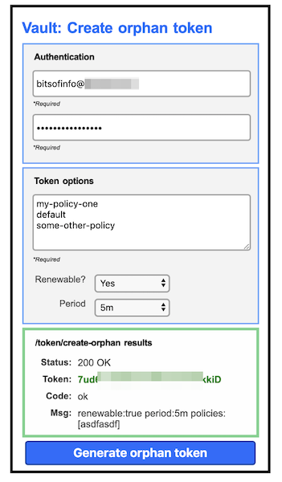

# vault-token-issuer



This project provides a simplified proxy/facade for [Vault's /auth/token/create-orphan API](https://www.vaultproject.io/api/auth/token/index.html).

This is **not** a straight layer 7 passthrough proxy, but rather this exposes a simplified API to create orphan tokens that will be created under the authority of the identity specified in an `Authentication` header who's contents can vary based on the `plugin` used when launching `vault-token-issuer`.

In addition to a simple REST API it also provides a simple SPA for creating orphan tokens implemented w/ React

Use cases:

* Continuous integration & delivery workflows that only need to generate use-case specific tokens 
* Limit direct/full exposure to Vault on a network
* Provide a restricted gateway to Vault's `/auth/token/create-orphan` API

## Basic example

### Launch the `vault-token-issuer`
```
vault-token-issuer -vault-url [VAULT_URL] -vault-authenticator [PLUGIN ('ldap')]
```

### Make a POST to generate an orphan token:
```
curl -X POST \
  https://<vault-token-issuer-url>/token/create-orphan \
  -H 'Authorization: Basic XXXXXX' \
  -H 'Content-Type: application/json' \
  -d '{"renewable":true, "period":"5m", "policies": ["my-policy1", "default"]}'

{"code":"ok","token":"XXXXXXXXXX","msg":"renewable:true period:5m policies:[my-policy1 default]"}
```

## How it works

1) Caller sends a `POST` to `/token/create-orphan` with a JSON payload to `vault-token-issuer`
   
2) `vault-token-issuer` relays the request's `Authorization` header to be processed by the `-vault-authenticator` configured on bootup. The `VaultAuthenticator` implementation takes the auth info and then makes a request to the Vault backend (`-vault-url`) to get back a `token` for the identity represented in the `Authorization` header.

3) The `token` returned from the previous step is then used to make a second call to the Vault backend's `/auth/token/create-orphan` endpoint using the payload data specified by the caller.

4) Upon success of the previous call, the generated orphan token is returned to the caller in a response JSON payload.

5) By default an SPA is available at `/ui` and a self-signed TLS cert is generated. See usage for options around both of these. Note the SPA React app is statically built into the binary via [vfsgen](https://github.com/shurcooL/vfsgen)

## Usage

```
Usage of ./vault-token-issuer:
  -enable-spa
        Serve the SPA at /ui, default enabled (default true)
  -listen-port int
        Optional, port to listen on, default 8443 (default 8443)
  -tls-cert-path string
        Optional: path to a PEM encoded TLS certificate. If omitted a self-signed cert will be auto generated
  -tls-key-path string
        Optional, path to a PEM encoded TLS private key. If omitted a self-signed cert will be auto generated
  -vault-authenticator string
        The vault authenticator plugin to use: valid options: 'ldap'
  -vault-url string
        Vault url where token API calls will be made. i.e. http(s)://<vault>[:port]
```

## Building

```
go generate
go build
```

## SPA

The included gui is implemented in React and available at `/ui` if enabled via `--enable-spa true|false`. More information in the [SPA README](spa/README.md)

 

